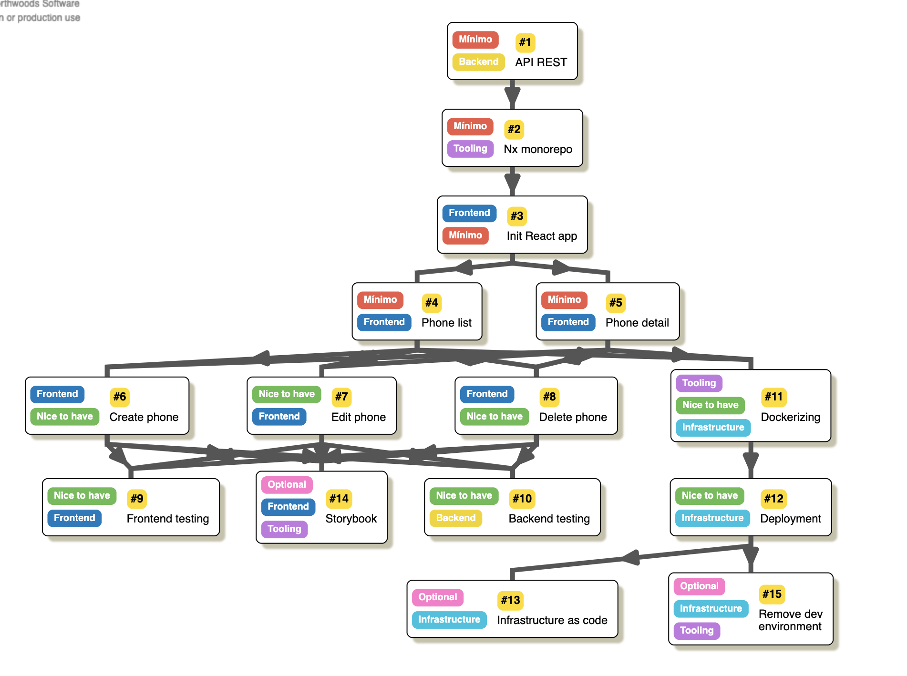
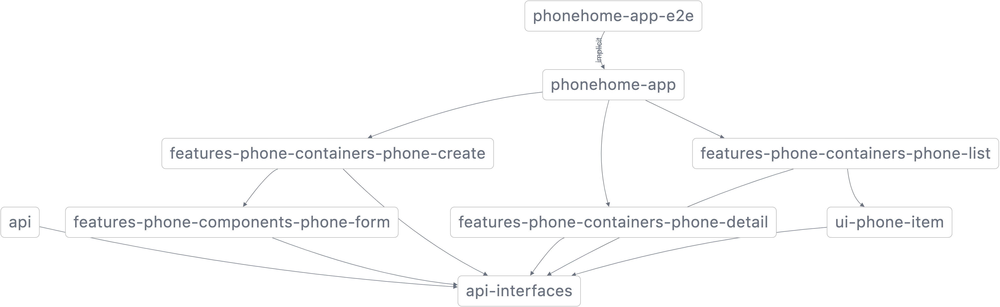

# Phonehome

The Phone Home is an web application that allows you to manage a catalogue of smartphones.
You can view the list of available phones, query its details and add new ones.

## Local installation

### Pre-requirements

Install [Node](https://nodejs.org/) version 16 (currently the latest stable).

If you're using `nvm`, add it with `nvm install --lts`.

### Install dependencies.

```
npm install
```

### Run REST API

Start the API server and leave it running:

```
npm run api
```

It should display in terminal that the API is connected to the database.

```
Listening at http://localhost:3333/api
Connected to database!
```

### Run frontend

Open an extra terminal and start the frontend application:

```
npm start
```

## Development

### Task breakdown

Before starting the development, I created a Trello board for this project and created tasks from the assignment document.

Then I added dependencies between tasks, so I produce a graph which would allow me to easily see the scope of the assignment and have present which tasks are minimal, which are optional and their order.



Also I added some optional tasks on my own as a challenge.

### Workspace management

In this project I'm using a monorepo management tool called Nx. It provides a CLI which is useful to quickly start projects thanks to generators for all kind of frameworks and stack. For example, to create this repo I used an option that initializes a React-Express stack.

```
npx create-nx-workspace@latest phone-home --preset="react-express"
```

With Nx I can also keep track of the library structure of my project. By running `npm run graph` we can see the project structure.


